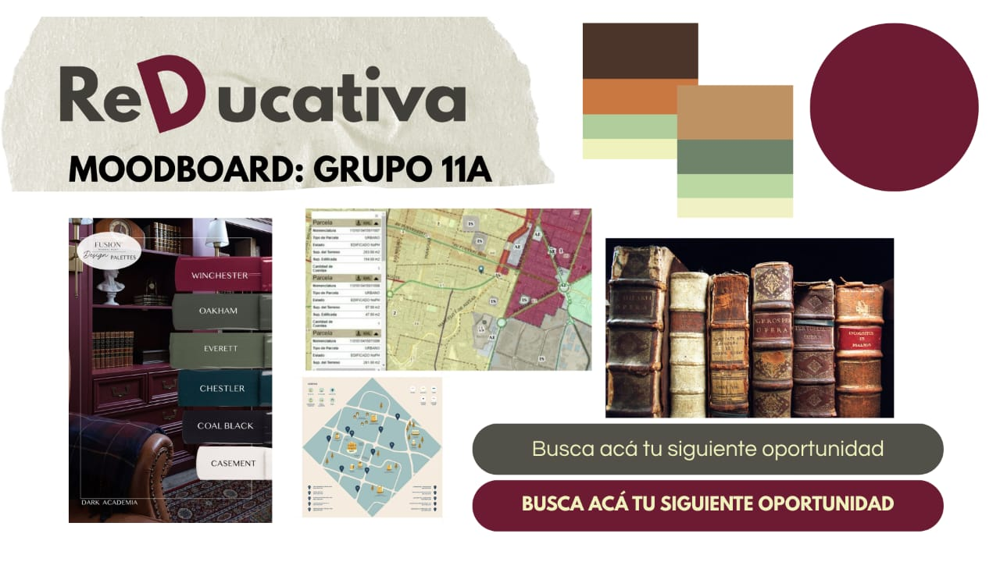

# 📚 re(d)ucativa

> _Transformando la educación, un estudiante a la vez_

Una plataforma web innovadora que democratiza el acceso a recursos educativos de calidad, combinando contenido gratuito online con oportunidades educativas presenciales para niños, adolescentes y jóvenes en Buenos Aires.

## 🚨 Problema que Abordamos

### ¿Cuál es el problema principal?

Creemos que el _mayor problema respecto a la educación actualmente_ es que la misma sigue siendo vista como un _privilegio_ en ciertos sectores y _no un derecho_.

### ¿Dónde ocurre?

- 📍 _Buenos Aires, Argentina_ - comunidad local prioritaria
- 🌎 Entendemos que hay jóvenes que se _pierden_ a la hora de elegir qué estudiar
- 🎯 Se relaciona directamente con el _ODS 4_: Educación de Calidad

---

## Inspiración

### Moodboard

 

## 👥 Público Objetivo

### ¿Quiénes son nuestros usuarios?

- 🧒 _Niños/Niñas_: Introducción temprana a recursos educativos
- 👦👧 _Adolescentes_: En proceso de definición vocacional
- 👨‍🎓👩‍🎓 _Jóvenes_: Buscando oportunidades de crecimiento académico

### ¿Quién usaría nuestra plataforma?

Estudiantes de _Buenos Aires_ que buscan expandir sus oportunidades educativas y necesitan orientación para tomar decisiones informadas sobre su futuro académico.

---

## 💡 Nuestra Solución

_re(d)ucativa_ es una _página web_ que funciona como _recopilación de datos_ sobre recursos educativos, diseñada para hacer más accesibles los recursos educativos y transformar esa realidad.

### 🌟 Lo que ofrecemos:

- 📱 _Cursos Online_: Acceso a contenido digital de calidad
- 🏫 _Modalidad Híbrida_: Combinación de virtual y presencial
- 👥 _Actividades Presenciales_: Talleres y eventos en Buenos Aires
- 🎓 _Oportunidades Educativas_: Información curada sobre becas, cursos y programas

---

## ✨ Funcionalidades Clave

### 🗂 _Mapa de Bibliotecas (+ Guía Explicativa)_

- 📍 Ubicación de bibliotecas públicas en Buenos Aires
- 📖 Guías detalladas de cómo aprovechar cada espacio
- 🕒 Horarios y servicios disponibles
- 📚 Catálogo de recursos por biblioteca

### 📅 _Publicación Semanal de Cursos_

- 🔄 Actualización constante de nuevas oportunidades
- 📧 Newsletter semanal con las mejores opciones
- 🆓 Filtrado de cursos gratuitos vs. pagos
- 📊 Categorización por área de estudio y nivel

---

## 🛠 Tecnologías Utilizadas

const tecnologias = {
frontend: ["HTML5", "CSS3", "JavaScript (Vanilla)"],
estilos: ["CSS Grid", "Flexbox", "Gradientes en CSS"],
tipografias: ["Playfair Display", "Source Sans Pro", "Crimson Text"],
responsive: "Enfoque mobile-first",
accesibilidad: "Pautas WCAG 2.1"
};

## 🎨 Identidad Visual

### Paleta de Colores

css
:root {
--bordo-primary: #722F37; /_ Color principal _/
--bordo-secondary: #8B4A52; /_ Hover states _/
--beige-primary: #F5E6D3; /_ Backgrounds _/
--beige-secondary: #E8D7C3; /_ Cards _/
--cream: #FAF7F0; /_ Main background _/
--accent-gold: #B8860B; /_ Highlights _/
}

### Tipografía Elegante

- _Playfair Display_: Títulos principales (serif clásica)
- _Source Sans Pro_: Texto del cuerpo (sans-serif moderna)
- _Crimson Text_: Subtítulos y elementos especiales

---

## 🚀 Comenzar

### Prerequisitos

bash

# Solo necesitas:

- Navegador web moderno (Chrome, Firefox, Safari, Edge)
- Editor de código (recomendado: VS Code)
- Git (para clonar el repositorio)

### Instalación Local

bash

# 1. Clonar el repositorio

git clone https://github.com/tu-usuario/reducativa.git

# 2. Navegar al directorio

cd reducativa

# 3. Abrir en tu editor

code .

# 4. Abrir con Live Server o simplemente:

# Doble click en index.html

### 🌍 Ver Demo en Vivo

👉 [reducativa.github.io](https://tu-usuario.github.io/reducativa)

---

## 📁 Estructura del Proyecto

reducativa/
├── 📄 index.html # Página principal
├── 🎨 styles.css # Estilos y diseño
├── ⚡ script.js # Funcionalidad JavaScript
├── 📖 README.md # Documentación
├── 📁 assets/ # Recursos estáticos
│ ├── 🖼 images/ # Imágenes optimizadas
│ ├── 🔤 fonts/ # Tipografías locales
│ └── 📊 data/ # JSON con datos de cursos
└── 📁 docs/ # Documentación adicional

---

## 🌟 Características Destacadas

- ✨ _Animaciones Suaves_: Micro-interacciones cuidadosamente diseñadas
- 📱 _100% Responsivo_: Perfecto en mobile, tablet y desktop
- ♿ _Accesible_: Diseño inclusivo con contraste adecuado
- ⚡ _Carga Rápida_: Optimizado para conexiones lentas
- 🎯 _UX Centrada en el Usuario_: Navegación intuitiva
- 🔍 _SEO Optimizado_: Estructura semántica correcta

---

## 🗺 Roadmap de Desarrollo

### 🎯 Fase 1: Fundación (Completada ✅)

- [x] Diseño y estructura base
- [x] Sistema de formularios funcional
- [x] Diseño responsivo implementado
- [x] Identidad visual establecida

### 🚀 Fase 2: Contenido (En Progreso 🚧)

- [ ] Base de datos de bibliotecas de Buenos Aires
- [ ] Sistema de categorización de cursos
- [ ] Integración con APIs educativas
- [ ] Buscador avanzado con filtros

### 📱 Fase 3: Interactividad (Planificado 📋)

- [ ] Sistema de usuarios y perfiles
- [ ] Guardado de favoritos
- [ ] Newsletter automatizado
- [ ] Reseñas y valoraciones de cursos

### 🌍 Fase 4: Comunidad (Futuro 🎯)

- [ ] Foro de estudiantes
- [ ] Eventos presenciales regulares
- [ ] Partnerships con instituciones educativas
- [ ] Expansión a otras ciudades de Argentina

---

## 🤝 Contribuir al Proyecto

¡Las contribuciones hacen que la comunidad open source sea un lugar increíble para aprender, inspirar y crear!

### 🛠 Cómo Contribuir

1. _Fork_ el proyecto
2. _Crea_ una rama para tu feature
   bash
   git checkout -b feature/nueva-funcionalidad
3. _Commit_ tus cambios
   bash
   git commit -m 'feat: añadir nueva funcionalidad increíble'
4. _Push_ a la rama
   bash
   git push origin feature/nueva-funcionalidad
5. _Abre_ un Pull Request

### 🐛 Reportar Bugs

Si encuentras un bug, por favor [abre un issue](https://github.com/tu-usuario/reducativa/issues) con:

- Descripción del problema
- Pasos para reproducirlo
- Comportamiento esperado
- Screenshots si es posible

---

## 🎓 Impacto Social - ODS 4

### Educación de Calidad 🎯

Este proyecto contribuye directamente al _Objetivo de Desarrollo Sostenible 4_:

- 🌍 _Acceso Universal_: Democratizando recursos educativos
- 💪 _Empoderamiento_: A través del conocimiento accesible
- 🤝 _Reducción de Brechas_: Entre diferentes sectores socioeconómicos
- 📈 _Mejora Continua_: Actualizaciones constantes de contenido

### Métricas de Impacto (Proyectadas)

- 📊 _500+ jóvenes_ alcanzados en el primer año
- 🏫 _50+ recursos educativos_ catalogados mensualmente
- 📚 _20+ bibliotecas_ mapeadas en Buenos Aires
- 🎓 _100+ oportunidades_ educativas publicadas

---

## 📄 Licencia

Este proyecto está bajo la _Licencia MIT_ - ver el archivo [LICENSE](LICENSE) para más detalles.

### ¿Qué significa esto?

✅ Uso comercial y privado  
✅ Modificación y distribución  
✅ Inclusión en proyectos privados  
❗ Sin garantía ni responsabilidad

---

### 🙏 Agradecimientos Especiales

- 📚 Bibliotecas públicas de Buenos Aires
- 🎓 Comunidad educativa argentina
- 💡 Todos los que creen en la educación como derecho

### 🌟 _¿Te gusta el proyecto?_

Si _re(d)ucativa_ te parece útil, ¡dale una ⭐ al repositorio!

Ayuda a que más jóvenes encuentren recursos educativos de calidad.

---

_re(d)ucativa_ - Transformando la educación, un estudiante a la vez 🎓

